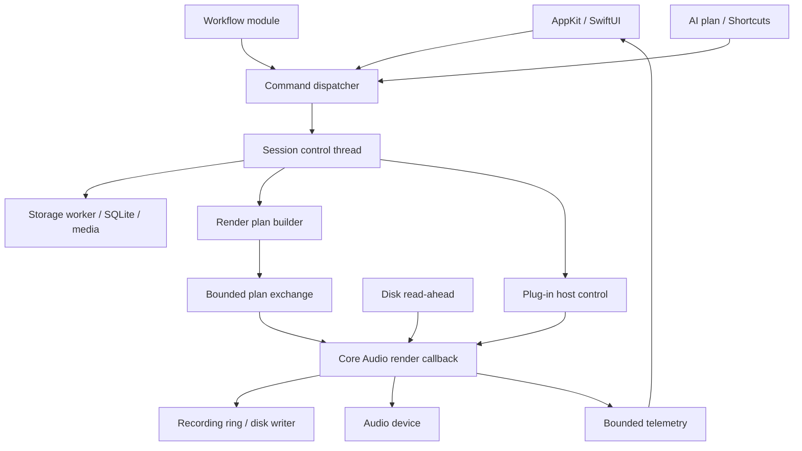

# Архитектура системы

## Контуры исполнения

Стрелки означают логическое взаимодействие. Они не означают синхронные вызовы между потоками. Реальные каналы и их ограничения определяются ниже.

## Владение состоянием

Session control thread — единственный владелец редактируемой модели проекта. UI получает immutable snapshot/diff с revision, meter data получает отдельно. Control thread валидирует команды и собирает следующую версию render plan. Render thread читает только опубликованный план и заранее выделенные буферы.

База — durable представление подтверждённых изменений. Control model может показывать pending изменение до подтверждения записи; UI различает pending, applied и saved. Это не три независимых источника истины: все получают один command ID и revision.

Selection, scroll, открытые панели — ephemeral UI state. Состояние plugin editor не смешивается с audio processor state. Transport runtime (playhead) не создаёт SQLite-транзакцию каждый буфер.

## Процессы и потоки

| Компонент | Контекст | Что разрешено |
|---|---|---|
| App UI | Main thread | View updates, input, windows, accessibility |
| Session controller | Один non-RT serial thread | Commands, topology, history, snapshots |
| Storage | Один writer + ограниченные readers | SQLite, checksums, file commit, backups |
| Engine | Core Audio RT callback | Prepared DSP, bounded queues, buffer copies |
| Streaming | Non-RT workers | Decode/read-ahead, запись файлов |
| Plug-in scanner | Disposable helper process | Discovery, instantiate/probe с timeout |
| AU hosting | Системный путь или выбранный helper | Зависит от проверенного режима конкретного AU |
| External workflow / ML | Отдельный worker process | Анализ ограниченных копий/handles, предложения команд |

В S0 app + engine находятся в одном процессе. Это не защищает запись от падения всего приложения; защита строится на восстановлении. Собственный отдельный audio-service не добавляется до измеримой потребности.

## Жизненный цикл редактирования

1. UI отправляет `commandId`, `projectId`, `expectedRevision`, тип операции и параметры.
2. Dispatcher проверяет схему, права источника, лимиты, существование объектов и revision.
3. Controller строит изменение и inverse для Undo, валидирует модель и запрашивает подготовку нужного плана/медиа.
4. Storage commit фиксирует durable изменение. Большие медиа должны быть готовы раньше ссылок на них.
5. Control model публикует revision; RT получает plan на границе блока. Подготовленная live-preview параметра может звучать раньше durable commit, но никогда не отмечается saved до него.
6. UI получает applied/saved revision; render acknowledgement отдельно сообщает звучащую generation.

Ошибка до commit не меняет подтверждённую модель. Ошибка публикации после commit оставляет сохранённый проект пригодным к открытию; UI показывает engine out-of-sync и предлагает restart engine. Нельзя откатывать SQLite «как будто ничего не было», если commit уже опубликован.

## Быстрые параметры и тяжёлые изменения

Fader gesture: bounded transient updates для прослушивания; при отпускании — одна команда с начальным и конечным значением. Undo отменяет gesture целиком. Automation write собирает точки с timestamps в отдельном буфере, затем коммитит сегмент.

Добавление дорожки, AU или связи — rebuild prepared graph вне RT. Исключения, создание плагина, file I/O и dispatch_sync в audio callback запрещены. Атомарный указатель сам по себе не решает освобождение прежнего плана: требуется отдельный retirement protocol.

## Plan exchange и ownership

Начальная реализация: один RT reader, bounded queue ID заранее подготовленных планов и обратная retire queue. Control владеет storage планов; RT после завершения последнего использования возвращает старый ID. Уничтожение происходит только control thread. Producer никогда не освобождает план по таймеру или предположению «буфер уже прошёл».

Если очередь заполнена, control объединяет ещё не опубликованные edits или сообщает busy; RT не ждёт. Для stop/shutdown: остановить callbacks, получить подтверждение, затем освобождать планы. Добавление parallel render workers требует обновлённого ownership-протокола и отдельного ADR.

## Публичный C bridge

Opaque `daw_session_t*`, fixed-width числа, versioned POD struct с `struct_size`, явные error codes. Создание/уничтожение только non-RT. Указатели borrowed действуют только в документированном scope. Строки UTF-8 копируются вызывающей стороной через length+buffer API. Исключения C++ ловятся внутри adapter и не пересекают ABI.

Внутри engine использовать C++ RAII, но не полагаться на последний `shared_ptr` release в callback. Вызовы Swift closures и ARC ownership transitions через RT-границу в baseline не допускаются.

## Независимые границы исходников

`domain` не импортирует AppKit, Core Audio и SQLite. `audio` знает prepared nodes и frame time. `platform/macos` реализует device/host adapters. `storage` сериализует domain. `commands` валидирует операции. `app` визуализирует snapshots. `modules` взаимодействуют только с command/query API.

Для тестов есть offline device adapter: он вызывает тот же render contract без реального устройства. Он доказывает DSP/sequence поведение, но не подтверждает latency и scheduling macOS.
