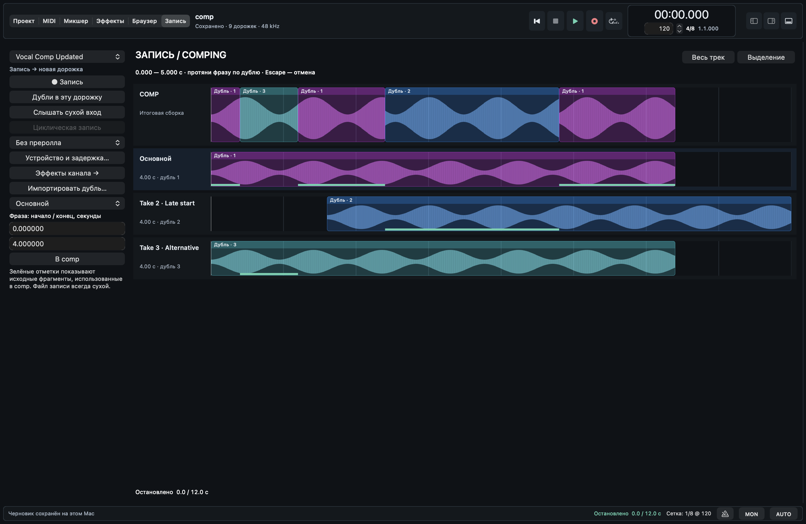

# Запись и comping: нативное рабочее пространство

Открывается кнопкой **Запись** или **Control-Command-6**. Это следующий срез
после [пяти рабочих поверхностей](IMPLEMENTATION.md), не реализация всех
плагинов и аудиовозможностей с изображения `04_vocal_comping.png`.

## Реализованный путь

Слева находятся выбор аудиодорожки, запись/остановка, arm, сухой мониторинг,
циклическая запись, преролл, переход к существующим настройкам устройства,
эффектам канала и импорту дубля. Справа — итоговый comp и исходные дубли.
Отображаются только данные текущей сессии: фиктивные волны, плагины, показания
задержки или микрофонного уровня не создаются.

Протянуть фразу по одному исходному дублю и отпустить мышь — одна команда
`daw_comp_range`, один шаг Undo. Пока мышь движется, меняется только временное
выделение. Обычный клик выбирает дубль; Escape отменяет жест. Поля начала/конца
в секундах и кнопка **В comp** выполняют ту же команду без перетаскивания.
Поддерживаются десятичная точка и запятая; отображаемое время сохраняет
точность до сэмпла при частоте проекта 48 кГц.

**Выделение** увеличивает выбранный интервал, **Весь трек** показывает все
дубли с учётом их смещения. Зелёные полосы отмечают фрагменты исходника,
использованные в comp; верхняя полоса показывает их реальное место в проекте.
Для зацикленных клипов эти отметки не рисуются, чтобы не обещать неверную
привязку исходника.

## Сохранность данных и ограничения

Команда привязана к существующему editor document token, ревизии, дорожке и индексу дубля на момент начала жеста.
Изменившаяся сессия отклоняет устаревший запрос; исходное аудио не перезаписывается.
Undo/Redo и сохранение comp используют существующие историю и формат проекта.
Повторное открытие документа с той же ревизией отменяет старый жест и
не принимает отложенный callback. Экспорт блокируется во время swipe.
Переключение экрана не запускает запись, не выбирает другую MIDI-дорожку
и не меняет компоновку аранжировки. Незавершённый swipe блокирует навигацию.

Редактирование comp недоступно при аудио/MIDI-захвате, импорте и экспорте.
Перекрывающиеся клипы требуют предварительной правки в Проекте: существующая
команда comp не принимает активные crossfade. Экран не снимает их автоматически
и не добавляет скрытые fade или коррекцию тайминга. Текущий предел команды —
10 минут проекта; выбор диапазона ограничен реальными границами дубля.

Преролл и сухой мониторинг используют уже существующий захват. Вход слышен
во время записи и преролла; это не аппаратный direct monitoring и не отдельный
cue mix. Физическая задержка не измеряется и не компенсируется этим экраном.
Цикл задаётся по полям выбранной фразы через существующий транспорт.
Отдельный punch-out, audition одного дубля без смены comp, pitch correction,
обработка вдохов и независимые миксы наушников в этот срез не входят.

## Проверки

`record_comp_selection_tests.swift` проверяет чистую геометрию, границы и
переполнение, направление жеста, невалидный ввод и точность секунд до сэмпла.
`record_comp_workspace_tests.swift` отправляет AppKit mouse/keyboard/button
события в реальные компоненты и проверяет результат через публичный C ABI.
Проверяются один commit на mouse-up, отмена/клик, повторное событие,
устаревшая ревизия, источник со смещением, numeric input, Undo/Redo,
save/open, захват MIDI и геометрия окна 1060/1536/1920.

Обе группы включены в `scripts/test-workspace-ui.sh`. Снимки
`record-comping-*.png` создаются настоящим AppKit renderer в CI и не являются
исходными дизайн-референсами. Звуковой материал для снимков создаётся только
в тестах и импортируется через публичный ABI.

`scripts/test-recording-ui.sh` дополнительно проверяет остановку записи и MON
через кнопки этого экрана, включая преролл. Подменяется только устройство:
renderer, C ABI, запись PCM, recovery и история остаются настоящими.
Это не проверка физического микрофона, акустической задержки или VoiceOver.

## Нативный снимок

Снимок сделан `record_comp_workspace_tests.swift` из AppKit, не генератором
изображений. Использован специально созданный тестовый PCM, а не запись
микрофона. Здесь показано три исходных дубля и comp из нескольких фрагментов.
В исходный набор из 17 дизайн-референсов этот снимок не входит.
